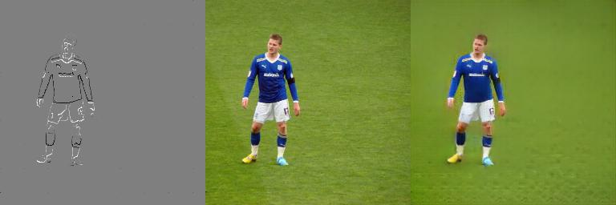

# contour2img
This repo is an implementation practice of paper [*Smart, Sparse Contours to Represent and Edit Images*](https://arxiv.org/abs/1712.08232). In this repo, an end-to-end network is trained to generate and edit image through contour domain. Details can be checked in the paper. This project is one baseline of my current research and I apologize for bugs. If you find any bugs, please issue me. Great thanks.

Thank [Tali Dekel](http://people.csail.mit.edu/talidekel/) for answering and explaining questions!

# Setup
  To run the code, you should have these libs installed in your cluster.
  * Python 3.x
  * Tensorflow
  * skimage
  
# Before Training
  Before training the network, you should know the meaning of parameters the code requires.
  * --lr, learning rate, where 0.0002 is used for my training
  * --t, material types for training. 3 different training materials are mentioned in the paper, which are, image features extracted through network, image gradient and image color. In this training, 0 is used for image features, 1 for image color and 2 for image gradients. (Strongly suggest to try type 1 first. I will debug for type 0 and type 2 after I finished my current research)
  * --s, sparse rate for contour extraction, where canny contour detection is implemented via tensorflow. 0.3 is used for my training.
  * --pre, step for training. This will be explained in the next section.

# Training
  We would train two times for the best results. Owing the general network is organized by two partial U-net, we need to train the first network (LFN) first with --pre set to 0. After train the LFN, we freeze the LFN and train the second refining network (HFN).
  You can train the network as follows:
  
  python train.py --lr 0.0002 --t 1 --s 0.3 --pre 0
  (Finish the first training)
  python train.py --lr 0.0002 --t 1 --s 0.3 --pre 1

  You can check "../train/lr_t_s/" to find the results generated through training
  
# Test
  To generate or edit your own image, you would use getBN.py to extract parameters for batchNorm first:
  
  python getBN.py
  
  Then you can run test code for any image you would like to generate:
  
  python test.py --lr 0.0002 --t 1 --s 0.3 --pre 1
  
# Results
  The following images are part of my results. The left part is the image from 6-channel contour domain, the mid one is the original input and the right one is the image generated through the network.
  
  
  
  
  
  
  
  
  
